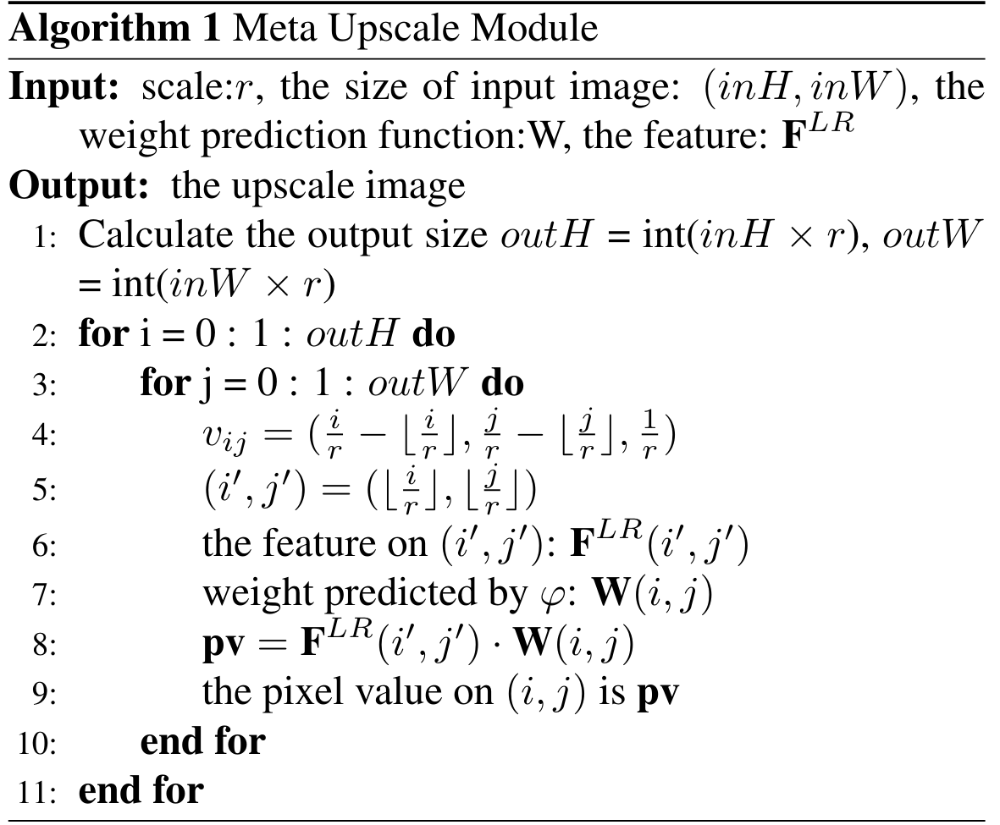

# Meta Upscale Implementation

This repo is an unofficial implementation of **meta upscale module** in paper *Meta-SR: A Magnification-Arbitrary Network for Super-Resolution*. 

Paper link: https://arxiv.org/abs/1903.00875 

## Requirements

python packages: torch, basicsr, and other essentials

software: CUDA

hardware: NVIDIA GPU

## Algorithm

In addition to the original algorithm, I modified the code to support different scale factors in horizontal and vertical directions. Two versions of implementation is offered in this repo: im2col and loop.

## im2col version

`r_v` and `r_h` is scale factors in vertical and horizontal direction, seperately.

The input LR (low resolution) feature map `x` has the shape of (n, c_in, h, w).

LR feature map `x` is first upscaled to HR (high resolution) `x_up` by repeating elements, see line 43-45 for detail. The shape of `x_up` is (n, c_in, H, W).

Then, `nn.functional.unfold` is called to do im2col operation to `x_up`. Shape of `x_up` changed to (H * W, n, c_in * k * k), see line 46.

Next, get the `weight` of convolution and reshape it into (H * W, c_in * k * k, out_c).

Finally, do batch matrix multiplication of `x_up` and `weight` to get the output. See line 51 and 52.

~~~python {.line-numbers}
class Pos2Weight(nn.Module):
    """Pos2Weight module for Meta-SR.
    (i/r_v - i//r_v, j/r_h- j//r_h, 1/r_v, 1/r_h) -> W
    """
    def __init__(self, in_c, out_c=1, kernel_size=3):
        super(Pos2Weight, self).__init__()
        self.in_c = in_c
        self.out_c = out_c
        self.kernel_size = kernel_size
        self.meta_block = nn.Sequential(
            nn.Linear(4, 256),
            nn.ReLU(inplace=True),
            nn.Linear(256, kernel_size * kernel_size * in_c * out_c),
        )
        
    def forward(self, x):
        x = self.meta_block(x)
        return x

class MetaUpsample_im2col(nn.Module):
    """Meta Upsample module
    """
    def __init__(self, in_c, out_c=1, kernel_size=3, s_v=2., s_h=2.):
        super(MetaUpsample, self).__init__()
        self.in_c = in_c
        self.out_c = out_c
        self.kernel_size = kernel_size
        self.s_v = s_v
        self.s_h = s_h
        self.phi = Pos2Weight(in_c, out_c, kernel_size)
        
    def forward(self, x, pos_mat):
        """
        Args:
            x (torch.Tensor): LR feature map. Shape: (n, in_c, in_h, in_w).
            pos_mat (torch.Tensor): Position matrix. Shape: (out_h * out_w, 4)
        """
        out_h = int(x.size(2) * self.s_v)
        out_w = int(x.size(3) * self.s_h)
        
        n = x.size(0)
        v_idxes = np.arange(out_h) // self.s_v
        h_idxes = np.arange(out_w) // self.s_h
        x_up = x[:, :, v_idxes, :][:, :, :, h_idxes] # (n, in_c, out_h, out_w)
        x_up = F.unfold(x_up, self.kernel_size, padding=1).permute(2, 0, 1) # (h_out * w_out, n, c_in * k * k)
        
        weight = self.phi(pos_mat) # (out_h * out_w, k * k * in_c * out_c)
        weight = weight.view(out_h * out_w, self.kernel_size * self.kernel_size * self.in_c, self.out_c)
        
        # (h_out * w_out, n, c_in * k * k) @ (h_out * w_out, c_in * k * k, out_c) -> (h_out * w_out, n, out_c)
        out = torch.bmm(x_up, weight).permute(1, 2, 0)
        return out.contiguous().view(n, self.out_c, out_h, out_w)
~~~

Im2col version of implementation is rather fast thanks to pytorch's built-in highly optimized matrix calculation libraries. Nonetheless, the memory consumption of upscaling LR feature map and im2col is rather high, which limits embedding dimensions in Transformer encoders. These 4 lines consume most of GPU memory in training process:

~~~python
v_idxes = np.arange(out_h) // self.s_v
h_idxes = np.arange(out_w) // self.s_h{
x_up = x[:, :, v_idxes, :][:, :, :, h_idxes] # (n, in_c, out_h, out_w)
x_up = F.unfold(x_up, self.kernel_size, padding=1).permute(2, 0, 1)}
~~~

To overcome this issue, the loop version meta upscale implementation is offered.

## loop version

The loop version is much easier to understand. It just implements the definition of convolution by simply looping over height, width, channel and kernel dimensions, no extra space is used. The demo python code:

~~~python {.line-numbers}
def meta_upscale_naive(x, weight, s_v, s_h, batch_size, in_c, out_c, out_h, out_w, kernel_size):
    weight = weight.view(out_h, out_w, kernel_size, kernel_size, in_c, out_c)
    out = torch.zeros(batch_size, out_c, out_h, out_w, requires_grad=True).cuda()
    x = nn.functional.pad(x, (1, 1, 1, 1))

    for i in tqdm(range(out_h)):
        for j in range(out_w):
            i_p = int(i / s_v)
            j_p = int(j / s_h)
            for k1 in range(kernel_size):
                for k2 in range(kernel_size):
                    for ci in range(in_c):    
                        for co in range(out_c):
                            out[:, co, i, j] += x[:, ci, i_p + k1, j_p + k2] * weight[i, j, k1, k2, ci, co]
    return out
~~~

Needless to say, this code is extremely inefficient. A more practical way is to write a new operator in CUDA/C++ and call it in pytorch. See `ops/meta_upscale` folder for details. 

Here are some tutorials on how to develop a new pytorch operator:
https://pytorch.org/tutorials/advanced/cpp_extension.html
https://zhuanlan.zhihu.com/p/595851188

The CUDA kernel code:
~~~cpp {.line-numbers}
// x: (n, c_in, h_in + pad, w_in + pad)
// weight: (out_h * out_w, k * k * in_c * out_c)
// out: (n, c_out, h_out, w_out)
__global__ void meta_upscale_forward_kernel(float *x, float *weight, float *out,
    float s_v, float s_h,
    int n, int c_in, int h_in, int w_in, int c_out, int h_out, int w_out, int ks)
{
    // const int tid_h = threadIdx.y;
    // const int tid_w = threadIdx.x;
    const int i = threadIdx.y + blockIdx.y * blockDim.y;
    const int j = threadIdx.x + blockIdx.x * blockDim.x;

    if (i >= h_out || j >= w_out) return;

    int i_p = i / s_v;
    int j_p = j / s_h;
    int h_in_pad = h_in + ks - 1;
    int w_in_pad = w_in + ks - 1;
    
    for (int ibatch = 0; ibatch < n; ++ibatch)
        for (int k1 = 0; k1 < ks; ++k1)
            for (int k2 = 0; k2 < ks; ++k2)
                for (int ci = 0; ci < c_in; ++ci)
                    for (int co = 0; co < c_out; ++co)
                    {
                        // w: (h_out, w_out, ks, ks, c_in, c_out)
                        // x: (n, c_in, h_in + pad, w_in + pad)

                        // w[i][j][k1][k2][ci][co]
                        int w_idx = co + ci * (c_out) + k2 * (c_out * c_in) \
                            + k1 * (c_out * c_in * ks) + j * (c_out * c_in * ks * ks) \
                            + i * (c_out * c_in * ks * ks * w_out);
                        // x[ibatch][ci][i_p + k1][j_p + k2]
                        int x_idx = (j_p + k2) + (i_p + k1) * (w_in_pad) + ci * (w_in_pad * h_in_pad) + ibatch * (w_in_pad * h_in_pad * c_in);
                        // out[ibatch][co][i][j]
                        int out_idx = j + i * (w_out) + co * (w_out * h_out) + ibatch * (w_out * h_out * c_out);
                        out[out_idx] += weight[w_idx] * x[x_idx];
                    }
}

__global__ void meta_upscale_backward_kernel(float *dx, float *dweight, float *dout, float *x, float *weight,
    float s_v, float s_h,
    int n, int c_in, int h_in, int w_in, int c_out, int h_out, int w_out, int ks)
{
    const int i = threadIdx.y + blockIdx.y * blockDim.y;
    const int j = threadIdx.x + blockIdx.x * blockDim.x;

    if (i >= h_out || j >= w_out) return;

    int i_p = i / s_v;
    int j_p = j / s_h;
    int h_in_pad = h_in + ks - 1;
    int w_in_pad = w_in + ks - 1;
    
    for (int ibatch = 0; ibatch < n; ++ibatch)
        for (int k1 = 0; k1 < ks; ++k1)
            for (int k2 = 0; k2 < ks; ++k2)
                for (int ci = 0; ci < c_in; ++ci)
                    for (int co = 0; co < c_out; ++co)
                    {
                        int w_idx = co + ci * (c_out) + k2 * (c_out * c_in) \
                            + k1 * (c_out * c_in * ks) + j * (c_out * c_in * ks * ks) \
                            + i * (c_out * c_in * ks * ks * w_out);
                        int x_idx = (j_p + k2) + (i_p + k1) * (w_in_pad) + ci * (w_in_pad * h_in_pad) + ibatch * (w_in_pad * h_in_pad * c_in);
                        int out_idx = j + i * (w_out) + co * (w_out * h_out) + ibatch * (w_out * h_out * c_out);
                        // Calculate gradients wrt x and weight
                        dweight[w_idx] += x[x_idx] * dout[out_idx];
                        atomicAdd(&dx[x_idx], weight[w_idx] * dout[out_idx]);
                    }

}
~~~

Loop version can save up to 40% of GPU memory compared to im2col version. (Tested on RTX4090, the maximum embed_dim in im2col version is 96, and 156 in loop version.)

## TODO

- Optimize CUDA kernel funtion using shared memory and other techniques.
- Use C++ templates to support different data types (like FP16).

